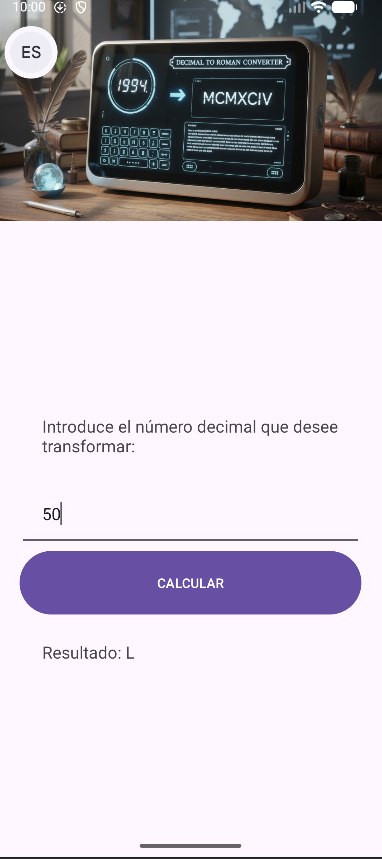
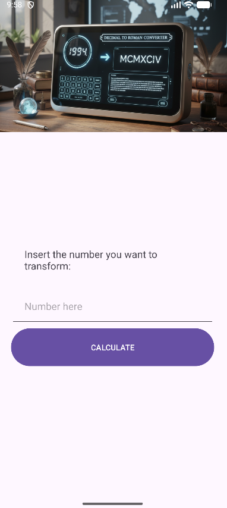

<div align="center">

# 📱 **Tarea 3 – Data Binding en Android**
### *Conversor de Números Romanos*
> 🧠 Proyecto académico que combina **funcionalidad, diseño y buenas prácticas** de desarrollo Android con **Data Binding** y **multilenguaje**.


</div>

---

## 🧾 **Descripción del proyecto**
Aplicación Android desarrollada como parte de la actividad **"Crea tu propio conversor temático con Data Binding"**.  
Convierte números decimales (1–3999) a su equivalente en **números romanos**, con una interfaz limpia, moderna y adaptable a distintos idiomas.

💡 **Características principales:**
- 🔗 **Data Binding:** conexión directa entre la lógica y la interfaz.
- 🌐 **Internacionalización (i18n):** disponible en **español** e **inglés**.
- 📱 **Diseño responsivo:** adaptado a distintos tamaños de pantalla.
- ⚙️ **Arquitectura limpia:** uso de **MVVM**.

---

## 👥 **Equipo de desarrollo**
| Integrante | Rol |
|-------------|------|
| **Miguel Ceballos Sánchez** | Lógica y estructura del conversor |
| **Félix Caballero Peña** | Implementación Data Binding y UI |
| **Alberto Alcalde Montero** | Internacionalización y pruebas |

---

## 🎯 **Objetivos de aprendizaje**
- Implementar correctamente **Data Binding** en Android Studio.  
- Aplicar **internacionalización** mediante `strings.xml` y `strings-en.xml`.  
- Diseñar una **interfaz funcional y estética** en XML.  
- Desarrollar una **lógica de conversión eficiente y validada**.  

---

## ⚙️ **Funcionamiento de la aplicación**
1. El usuario introduce un número decimal entre **1 y 3999**.  
2. Pulsa el botón **“Calcular”** 🔢.  
3. La aplicación muestra el número romano equivalente.  
4. Si el número no es válido, se muestra un aviso 🚫.  
5. La interfaz cambia automáticamente según el idioma del sistema 🌍.

---

## 🧮 **Ejemplo de uso**
| Entrada | Resultado |
|----------|------------|
| `5`      | `V`        |
| `19`     | `XIX`      |
| `2024`   | `MMXXIV`   |
| `3999`   | `MMMCMXCIX`|

---

## 🧰 **Tecnologías utilizadas**
| Herramienta | Descripción |
|--------------|-------------|
| ☕ **Java** | Lenguaje principal de programación |
| 🏗️ **Android Studio** | Entorno de desarrollo |
| 🧩 **MVVM + Data Binding** | Arquitectura limpia y modular |
| 📱 **Compatibilidad:** Android 7.0+ (API 24) | Soporte multiplataforma |

---

## 🌍 **Internacionalización**
| Idioma | Archivo | Descripción |
|--------|----------|-------------|
| 🇪🇸 Español | `/res/values/strings.xml` | Textos principales |
| 🇬🇧 Inglés | `/res/values-en/strings.xml` | Traducción completa |

---

## 🗂️ **Estructura del proyecto**
```bash
app/
├── java/com/sinBinding/numerosromanos/
│   ├── MainActivity.java
│   ├── Conversor.java
│   └── res/layout/activity_main.xml
│
├── java/com/conBinding/numerosromanos/
│   ├── MainViewModel.java
│   ├── MainActivity.java
│   ├── Conversor.java
│   └── res/layout/activity_main.xml
│
└── res/
    ├── values/strings.xml
    ├── values-en/strings.xml
    └── layout/activity_main.xml
```

---

## 📸 **Capturas de pantalla**

### 🏠 Pantalla principal  


### 🔢 Ejemplo de conversión  


### 🌐 Versión en inglés  


---

## 🚀 **Cómo ejecutar el proyecto**
1. Clona el repositorio:  
   ```bash
   git clone https://github.com/usuario/conversor-romanos.git
   ```
2. Abre el proyecto en **Android Studio**.  
3. Ejecuta la app en un **emulador** o **dispositivo físico**.  

---

<div align="center">

💚 Desarrollado con dedicación por estudiantes apasionados por Android 💚  
📅 *Curso 2024–2025*  
🎓 *Asignatura: Tecnologías Avanzadas aplicadas a la Docencia*  

</div>
